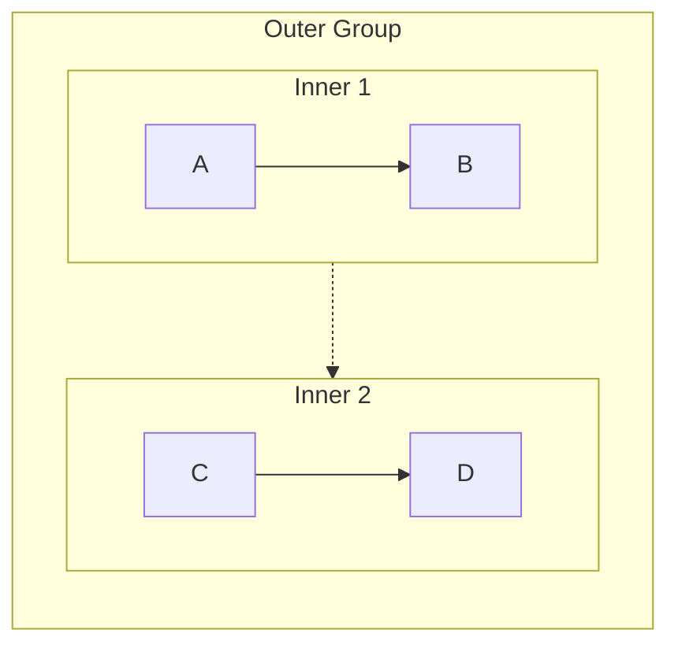
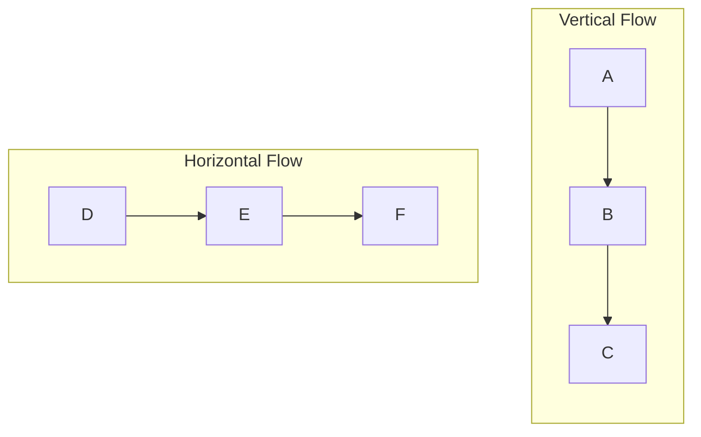
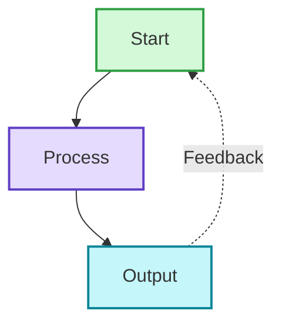
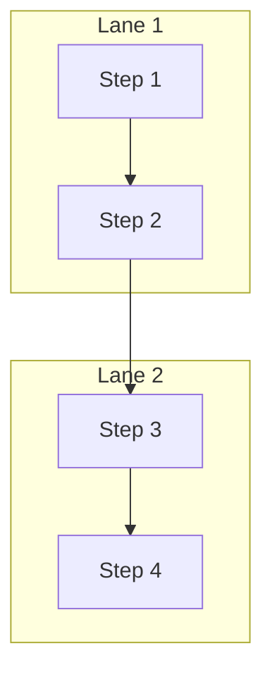
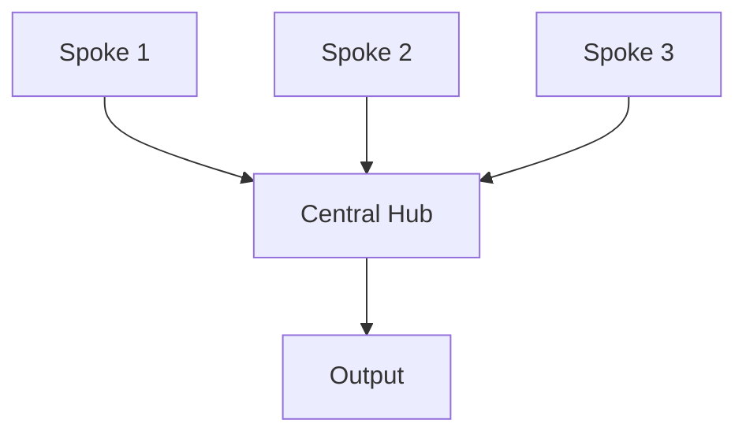

# Mermaid Syntax Rules Reference

This reference provides comprehensive syntax rules and error prevention strategies for Mermaid diagrams. Load this when encountering syntax errors or needing detailed syntax information.

## Table of Contents

1. [Critical Error Prevention](#critical-error-prevention)
2. [Node Syntax](#node-syntax)
3. [Subgraph Syntax](#subgraph-syntax)
4. [Arrow and Connection Types](#arrow-and-connection-types)
5. [Styling and Colors](#styling-and-colors)
6. [Layout and Direction](#layout-and-direction)
7. [Advanced Patterns](#advanced-patterns)
8. [Troubleshooting](#troubleshooting)

## Critical Error Prevention

### List Syntax Conflict (Most Common Error)

**Problem:** Mermaid parser interprets `number. space` as Markdown ordered list syntax.

**Error Message:** `Parse error: Unsupported markdown: list`

**Solutions:**

```mermaid
❌ [1. Perception]
❌ [2. Planning]
❌ [3. Reasoning]

✅ [1.Perception]           # Remove space
✅ [① Perception]           # Use circled numbers
✅ [(1) Perception]         # Use parentheses  
✅ [Step 1: Perception]     # Use prefix
✅ [Step 1 - Perception]    # Use dash
✅ [Perception]             # Remove numbering
```

**Circled number reference:**
```
① ② ③ ④ ⑤ ⑥ ⑦ ⑧ ⑨ ⑩ ⑪ ⑫ ⑬ ⑭ ⑮ ⑯ ⑰ ⑱ ⑲ ⑳
```

### Subgraph Naming Rules

**Rule:** Subgraphs with spaces must use ID + display name format.

```mermaid
❌ subgraph Core Process
     A --> B
   end

✅ subgraph core["Core Process"]
     A --> B
   end

✅ subgraph core_process
     A --> B
   end
```

**Referencing subgraphs:**
```mermaid
❌ Title --> Core Process      # Cannot reference display name
✅ Title --> core              # Must reference ID
```

### Node Reference Rules

**Rule:** Always reference nodes by ID, never by display text.

```mermaid
# Define nodes
A[Display Text A]
B["Display Text B"]

# Reference nodes
A --> B                        ✅ Use node IDs
Display Text A --> Display Text B  ❌ Cannot use display text
```

## Node Syntax

### Basic Node Types

```mermaid
# Rectangle (default)
A[Rectangle Text]

# Rectangle with rounded corners
B(Rounded Text)

# Stadium shape
C([Stadium Text])

# Circle
D((Circle<br/>Text))

# Asymmetric shape
E>Right Arrow]

# Rhombus (decision)
F{Decision?}

# Hexagon
G{{Hexagon}}

# Parallelogram
H[/Parallelogram/]

# Database
I[(Database)]

# Trapezoid
J[/Trapezoid\]
```

### Node Text Rules

**Line breaks:**
- `<br/>` only works in circle nodes: `((Text<br/>Break))`
- For other nodes, use separate annotation nodes or keep text concise

**Special characters:**
- Spaces: Use quotes if needed: `["Text with spaces"]`
- Quotes: Replace with 『』or avoid
- Parentheses: Replace with 「」or avoid
- Colons: Generally safe but avoid if causing issues
- Hyphens/dashes: Safe to use

**Length guidelines:**
- Keep node text under 50 characters
- Use multiple lines (circle nodes) or separate annotation nodes for longer content
- Consider splitting into multiple nodes if text is too long

## Subgraph Syntax

### Basic Structure

```mermaid
graph TB
    # Correct format with ID and display name
    subgraph id["Display Name"]
        direction TB
        A --> B
    end
    
    # Simple ID only (no spaces)
    subgraph simple
        C --> D
    end
    
    # Can set direction inside subgraph
    subgraph horiz["Horizontal"]
        direction LR
        E --> F
    end
```

### Nested Subgraphs



**Limitation:** Keep nesting to 2 levels maximum for readability.

### Connecting Subgraphs

```mermaid
graph TB
    subgraph g1["Group 1"]
        A[Node A]
    end
    
    subgraph g2["Group 2"]
        B[Node B]
    end
    
    # Connect individual nodes (recommended)
    A --> B
    
    # Connect subgraphs (creates invisible link for layout)
    g1 -.-> g2
```

## Arrow and Connection Types

### Basic Arrows

```mermaid
A --> B          # Solid arrow
A -.-> B         # Dashed arrow
A ==> B          # Thick arrow
A ~~~> B         # Invisible link (layout only, not rendered)
```

### Arrow Labels

```mermaid
A -->|Label Text| B
A -.->|Optional| B
A ==>|Important| B
```

### Multi-target Connections

```mermaid
# One to many
A --> B & C & D

# Many to one
A & B & C --> D

# Chaining
A --> B --> C --> D
```

### Bidirectional

```mermaid
A <--> B         # Bidirectional solid
A <-.-> B        # Bidirectional dashed
```

## Styling and Colors

### Inline Styling

```mermaid
style NodeID fill:#color,stroke:#color,stroke-width:2px
```

### Color Format

- Hex colors: `#ff0000` or `#f00`
- RGB: `rgb(255,0,0)`
- Color names: `red`, `blue`, etc. (limited support)

### Common Style Patterns

```mermaid
# Professional look
style A fill:#d3f9d8,stroke:#2f9e44,stroke-width:2px

# Emphasis
style B fill:#ffe3e3,stroke:#c92a2a,stroke-width:3px

# Muted/secondary
style C fill:#f8f9fa,stroke:#dee2e6,stroke-width:1px

# Title/header
style D fill:#1971c2,stroke:#1971c2,stroke-width:3px,color:#ffffff
```

### Styling Multiple Nodes

```mermaid
# Apply same style to multiple nodes
style A,B,C fill:#d3f9d8,stroke:#2f9e44,stroke-width:2px
```

## Layout and Direction

### Direction Codes

```mermaid
graph TB    # Top to Bottom (vertical)
graph BT    # Bottom to Top
graph LR    # Left to Right (horizontal)
graph RL    # Right to Left
graph TD    # Top Down (same as TB)
```

### Layout Control Tips

1. **Vertical layouts (TB/BT):** Best for sequential processes, hierarchies
2. **Horizontal layouts (LR/RL):** Best for timelines, wide displays
3. **Mixed directions:** Set different directions in subgraphs



## Advanced Patterns

### Feedback Loop Pattern



### Swimlane Pattern



### Hub and Spoke



### Decision Tree

```mermaid
graph TB
    Start[Start] --> Decision{Decision Point?}
    Decision -->|Option A| PathA[Path A]
    Decision -->|Option B| PathB[Path B]
    Decision -->|Option C| PathC[Path C]
    
    PathA --> End[End]
    PathB --> End
    PathC --> End
```

### Comparison Layout

```mermaid
graph TB
    Title[Comparison]
    
    subgraph left["System A"]
        A1[Feature 1]
        A2[Feature 2]
        A3[Feature 3]
    end
    
    subgraph right["System B"]
        B1[Feature 1]
        B2[Feature 2]
        B3[Feature 3]
    end
    
    Title --> left
    Title --> right
    
    subgraph compare["Key Differences"]
        Diff[Difference Summary]
    end
    
    left --> compare
    right --> compare
```

## Troubleshooting

### Common Errors and Solutions

#### Error: "Parse error on line X: Expecting 'SEMI', 'NEWLINE', 'EOF'"

**Causes:**
1. Subgraph name with spaces not using ID format
2. Node reference using display text instead of ID
3. Invalid special characters in node text

**Solutions:**
- Use `subgraph id["Display Name"]` format
- Reference nodes by ID only
- Quote node text with special characters

#### Error: "Unsupported markdown: list"

**Cause:** Using `number. space` pattern in node text

**Solution:** Remove space or use alternatives (①, (1), Step 1:)

#### Error: "Parse error: unexpected character"

**Causes:**
1. Unescaped special characters
2. Improper quotes
3. Invalid Mermaid syntax

**Solutions:**
- Replace problematic characters (quotes → 『』, parens → 「」)
- Use proper node definition syntax
- Check arrow syntax

#### Diagram doesn't render correctly

**Causes:**
1. Missing style declarations
2. Incorrect direction specification
3. Invalid connections

**Solutions:**
- Verify all style declarations use valid syntax
- Check direction is set in graph declaration or subgraph
- Ensure all node IDs are defined before referencing

### Validation Checklist

Before finalizing any diagram:

- [ ] No `number. space` patterns in node text
- [ ] All subgraphs use proper ID syntax if they contain spaces
- [ ] All node references use IDs not display text
- [ ] All arrows use valid syntax (-->, -.->)
- [ ] All style declarations are syntactically correct
- [ ] Direction is explicitly set
- [ ] No unescaped special characters in node text
- [ ] All connections reference defined nodes

### Platform-Specific Notes

**Obsidian:**
- Older Mermaid version, more strict parsing
- Limited support for `<br/>` (only in circle nodes)
- Test diagrams before finalizing

**GitHub:**
- Good Mermaid support
- Renders most modern syntax
- May differ slightly from Obsidian rendering

**Mermaid Live Editor:**
- Most up-to-date parser
- Best for testing new syntax
- May support features not available in Obsidian/GitHub

## Quick Reference

### Safe Numbering Methods
✅ `1.Text` `①Text` `(1)Text` `Step 1:Text`
❌ `1. Text`

### Safe Subgraph Syntax
✅ `subgraph id["Name"]` `subgraph simple_name`
❌ `subgraph Name With Spaces`

### Safe Node References
✅ `NodeID --> AnotherID`
❌ `"Display Text" --> "Other Text"`

### Safe Special Characters
✅ `『』` for quotes, `「」` for parentheses
❌ `"` unescaped quotes, `()` in problematic contexts