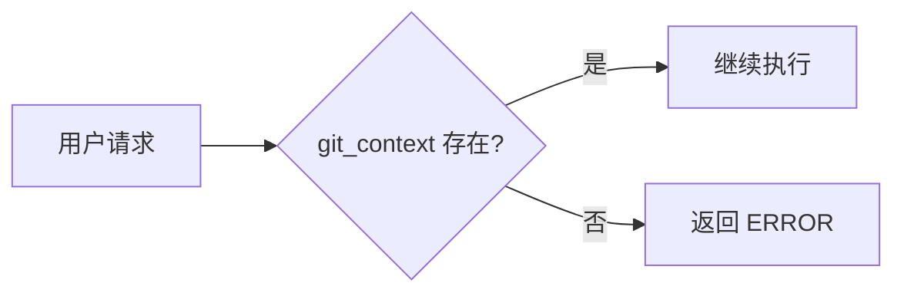

# DTG 代码审查技能 (dtg-code-review)

企业级代码审查编排技能，专为 Spring Boot + Dubbo 微服务架构设计。

---

## 目录

- [概述](#概述)
- [快速开始](#快速开始)
- [使用场景](#使用场景)
- [执行流程详解](#执行流程详解)
- [审查范围](#审查范围)
- [输出格式](#输出格式)
- [使用示例](#使用示例)
- [关键约束](#关键约束)
- [错误处理](#错误处理)
- [技术架构](#技术架构)
- [常见问题](#常见问题)

---

## 概述

`dtg-code-review` 是一个**代码审查编排技能**，它：

- 将所有代码分析委托给 `code-review` 插件
- 将审查发现转发给 `security_scan_owasp_sonar` 进行安全扫描
- 提供结构化的审查工作流，集成安全扫描能力
- 专为 Spring Boot 2.7 + Dubbo 3.2 微服务架构优化

### 核心特点

| 特点 | 说明 |
|------|------|
| **编排式设计** | 委托专业插件执行分析，不自作主张 |
| **安全集成** | 自动转发发现给安全扫描工具 |
| **上下文驱动** | 必须基于 git 上下文执行 |
| **结构化输出** | 统一的报告格式，便于跟踪 |

---

## 快速开始

### 前置要求

在使用此技能之前，**必须**先获取 Git 仓库上下文。

### 基本用法

```bash
# 步骤 1: 获取 git 上下文（强制要求）
git_context

# 步骤 2: 调用代码审查技能
/dtg_code_review
```

### 典型工作流

```
1. 用户发起审查请求
   ↓
2. 技能检查 git_context 是否存在
   ↓ (不存在则报错)
3. 调用 code-review 插件执行分析
   ↓
4. 将发现转发给 security_scan_owasp_sonar
   ↓
5. 输出结构化审查报告
```

---

## 使用场景

### 1. 拉取请求审查

对 PR 或提交执行全面的代码审查：

```
审查 PR #123 中的代码变更
```

### 2. 代码质量分析

分析特定维度的代码质量：

```
分析以下文件的 Java 代码质量
```

### 3. API 兼容性检查

检查接口变更的兼容性影响：

```
检查这个提交的 API 兼容性
```

### 4. 并发安全审查

检测线程安全问题：

```
审查此 PR 中的代码是否存在并发问题
```

### 5. 错误处理审查

分析异常处理和错误恢复：

```
分析这些文件的错误处理是否正确
```

---

## 执行流程详解

### 前置条件检查



**停止规则**：如果 `git_context` 未执行，仅响应：

```
ERROR: Missing git_context
```

### 分析执行阶段

| 步骤 | 说明 | 约束 |
|------|------|------|
| 1 | 调用 code-review 插件 | 所有分析必须通过插件执行 |
| 2 | 收集插件发现 | 不得手动分析代码 |
| 3 | 转发给安全扫描 | 必须转发所有发现 |
| 4 | 生成报告 | 不提供审批决策 |

### 关键要求

- **禁止手动分析**：所有代码分析必须使用 `code-review` 插件执行
- **禁止审批决策**：不提供批准/拒绝变更的决策
- **必须转发**：所有发现必须发送给 `security_scan_owasp_sonar`

---

## 审查范围

此技能专注于以下代码质量维度：

### 1. Java 代码质量

- 代码规范检查
- 最佳实践验证
- 代码异味检测
- 复杂度分析

### 2. API 接口兼容性

- 接口变更影响分析
- 向后兼容性检查
- Dubbo 服务契约验证
- RESTful API 规范

### 3. 并发与线程安全

- 线程安全问题
- 并发风险检测
- 死锁可能性分析
- 共享资源保护

### 4. 错误处理与正确性

- 异常处理机制
- 边界条件检查
- 错误恢复策略
- 业务逻辑正确性

---

## 输出格式

审查结果包含以下部分：

| 部分 | 描述 |
|------|------|
| **插件摘要** | 来自 code-review 插件的高级概览 |
| **插件发现** | 来自 code-review 插件的详细发现 |
| **未解决问题** | 任何需要注意的问题列表 |
| **转发上下文** | 传递给 security_scan_owasp_sonar 的上下文 |

### 输出示例

```
## 插件摘要

本次审查覆盖了 5 个文件，发现 3 个中等问题和 1 个高优先级问题。

## 插件发现

### 高优先级

[!] 潜在的线程安全问题 - PaymentService.java:142
    多线程环境下可能出现竞态条件

### 中等问题

[i] 缺少异常处理 - OrderController.java:78
    建议: 添加 try-catch 块或使用全局异常处理器

## 未解决问题

1. PaymentService.java:142 - 需要添加同步机制
2. OrderController.java:78 - 需要完善异常处理

## 转发上下文

[已转发至 security_scan_owasp_sonar 进行安全扫描]
```

---

## 使用示例

### 示例 1: 审查并发问题

```
用户: 审查此 PR 中的代码是否存在并发问题

执行:
→ 使用 git_context 调用 code-review 插件
→ 将结果转发给 security_scan_owasp_sonar
→ 输出并发安全分析报告
```

### 示例 2: 审查 API 变更

```
用户: 检查这个提交的 API 兼容性

执行:
→ 使用 git_context 调用 code-review 插件
→ 聚焦于接口变更分析
→ 转发发现至安全扫描
→ 输出兼容性评估报告
```

### 示例 3: 审查错误处理

```
用户: 分析这些文件的错误处理是否正确

执行:
→ 使用 git_context 调用 code-review 插件
→ 聚焦于异常处理机制
→ 转发发现至安全扫描
→ 输出错误处理评估报告
```

### 示例 4: 无效触发（缺少上下文）

```
用户: 审查此文件是否存在错误

执行:
→ 检查 git_context
→ 如果缺少 → 返回 "ERROR: Missing git_context"
```

---

## 关键约束

### 必须遵守的规则

| 规则 | 说明 |
|------|------|
| **禁止手动分析** | 不要自己执行代码分析 |
| **禁止审批决策** | 不要批准/拒绝变更 |
| **始终转发** | 始终将发现发送给 security_scan_owasp_sonar |
| **严格格式** | 严格按照输出格式执行 |

### 设计原则

1. **编排者而非执行者** - 此技能是工作流编排器，不是代码分析引擎
2. **依赖专业工具** - 利用 `code-review` 插件的专业分析能力
3. **安全优先** - 所有发现必须经过安全扫描
4. **客观报告** - 提供客观分析，不做主观决策

---

## 错误处理

### 缺少上下文错误

如果 `git_context` 未执行，技能将返回：

```
ERROR: Missing git_context
```

**解决方案**：先运行 `git_context` 命令获取仓库上下文。

### 其他错误

| 错误 | 可能原因 | 解决方案 |
|------|----------|----------|
| 插件调用失败 | code-review 插件不可用 | 检查插件安装 |
| 转发失败 | security_scan_owasp_sonar 不可用 | 检查安全扫描配置 |

---

## 技术架构

```
┌─────────────────────────────────────────────────────────┐
│                      用户请求                           │
└────────────────────┬────────────────────────────────────┘
                     ↓
┌─────────────────────────────────────────────────────────┐
│            dtg-code-review (编排层)                      │
│  • 检查 git_context                                      │
│  • 调用 code-review 插件                                 │
│  • 转发发现                                              │
└────────┬────────────────────────────┬───────────────────┘
         ↓                            ↓
┌──────────────────────┐   ┌──────────────────────────┐
│  code-review 插件    │   │ security_scan_owasp_sonar│
│  • 代码质量分析      │   │ • 安全漏洞扫描           │
│  • 兼容性检查        │   │ • OWASP Top 10 检测      │
│  • 并发安全检测      │   │ • SonarQube 规则         │
└──────────┬───────────┘   └──────────┬───────────────┘
           ↓                         ↓
           └─────────┬────────────────┘
                     ↓
┌─────────────────────────────────────────────────────────┐
│                  审查结果报告                           │
│  • 插件摘要                                             │
│  • 插件发现                                             │
│  • 未解决问题                                           │
│  • 转发上下文                                           │
└─────────────────────────────────────────────────────────┘
```

---

## 常见问题

### Q1: 为什么必须先执行 git_context？

**A**: 此技能需要了解仓库的当前状态、分支、变更等上下文信息才能进行准确的代码审查。

### Q2: 为什么不直接分析代码？

**A**: 此技能是编排器，专门负责协调专业工具。`code-review` 插件拥有更强大的代码分析能力。

### Q3: 安全扫描是可选的吗？

**A**: 不是。所有发现必须转发给 `security_scan_owasp_sonar`，这是强制的安全流程。

### Q4: 技能会批准或拒绝我的 PR 吗？

**A**: 不会。此技能只提供客观的分析报告，不做审批决策。

### Q5: 可以只审查特定文件吗？

**A**: 可以。在请求中明确指定文件路径即可，例如：
```
审查 PaymentService.java 和 OrderController.java 的错误处理
```

---

## 项目适配

此技能针对 dtg-pay 项目的特定技术栈优化：

- **Java 11** - 语言特性检查
- **Spring Boot 2.7** - 框架最佳实践
- **Dubbo 3.2** - RPC 服务契约验证
- **MyBatis-Plus** - ORM 层检查
- **微服务架构** - 分布式特有问题检测

---

*版本: 1.0.0 | 更新日期: 2026-01-04*
