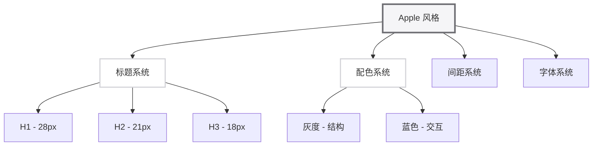

# Apple Style in Obsidian

本文档展示如何在 Obsidian 中应用 Apple 风格的 Markdown 排版，结合 Obsidian 的特有功能创建优雅的笔记体验。

## Obsidian 增强功能

Obsidian 提供了许多标准 Markdown 之外的功能，与 Apple 风格完美结合。

### YAML Frontmatter

每个笔记开头使用 YAML frontmatter 存储元数据：

```yaml
---
title: 笔记标题
created: 2024-01-25
tags: [tag1, tag2, tag3]
cssclass: apple-style
type: docs
status: in-progress
---
```

这些元数据可以用于：
- 文档组织和搜索
- 应用自定义 CSS 类
- 笔记状态追踪
- Dataview 插件查询

### Wikilinks

使用 `[[双中括号]]` 创建内部链接：

- [[Apple Style Formatter]] - 链接到其他笔记
- [[设计系统#配色系统]] - 链接到特定章节
- [[Obsidian 笔记示例|自定义显示文本]] - 自定义链接文本

Wikilinks 会自动应用 Apple 蓝色 (#0071e3)，保持一致的视觉风格。

## Callout 块

Obsidian 的 callout 功能与 Apple 风格的引用块完美融合：

> [!INFO] 信息提示
> 这是一个信息类型的 callout。使用浅蓝色背景和左侧边框，与 Apple 设计语言保持一致。

> [!WARNING] 注意事项
> 这是警告类型的 callout。使用浅黄色背景，保持柔和的视觉效果。

> [!TIP] 实用技巧
> 这是技巧类型的 callout。使用浅绿色背景，提供友好的视觉提示。

> [!IMPORTANT] 重要内容
> 这是重要类型的 callout。使用浅红色背景，突出关键信息。

所有 callout 块都遵循 Apple 的圆角设计（右侧 4px 圆角）和间距规范（上下 16px 外边距）。

## 标签系统

使用 `#标签` 组织内容：

#apple-style #obsidian #formatting #design-system

标签会在笔记中显示为小型的胶囊状元素，使用浅灰色背景和圆角设计。

---

## 嵌入内容

### 嵌入其他笔记

![[Apple Style Formatter]]

嵌入的内容会保持原始文档的 Apple 风格格式。

### 嵌入特定章节

![[Apple Style Formatter##设计原则]]

只嵌入文档的特定部分，保持上下文清晰。

### 嵌入图片

![[screenshot.png|300]]

图片会自动应用 8px 圆角，与整体设计风格协调。

---

## 任务列表

Apple 风格的任务列表保持简洁：

### 待办事项

- [ ] 创建新的 Apple 风格笔记
- [x] 应用三级标题系统
- [x] 配置 YAML frontmatter
- [ ] 添加代码块示例
- [ ] 测试响应式布局

### 已完成

- [x] 设计配色系统
- [x] 定义字体栈
- [x] 设置间距规范

任务列表使用标准的复选框样式，与整体设计保持一致。

## 表格样式

表格使用简洁的边框和充足的间距：

| 元素 | 颜色 | 色值 | 用途 |
|------|------|------|------|
| 主文本 | 近黑色 | #1d1d1f | 正文、标题 |
| 次要文本 | 中灰色 | #6e6e73 | 辅助说明 |
| 链接蓝 | Apple 蓝 | #0071e3 | 链接 |
| 背景 | 纯白色 | #ffffff | 页面背景 |

表格使用浅灰色边框（#d2d2d7），行高 1.8，保持可读性。

---

## 代码块与语法高亮

结合 Obsidian 的语法高亮和 Apple 风格：

### Python 示例

```python
def apply_apple_style(content: str) -> dict:
    """
    应用 Apple 风格格式化

    Args:
        content: Markdown 内容

    Returns:
        包含格式化结果的字典
    """
    result = {
        'headings': apply_heading_hierarchy(content),
        'spacing': adjust_spacing(content),
        'colors': apply_color_system(content)
    }
    return result
```

### JavaScript 示例

```javascript
// Apple 风格配置
const appleStyleConfig = {
    typography: {
        lineHeight: 1.8,
        letterSpacing: '0.02em',
        fontSize: '16px'
    },
    colors: {
        primary: '#1d1d1f',
        secondary: '#6e6e73',
        accent: '#0071e3'
    },
    spacing: {
        base: 8,
        paragraph: 12,
        section: 24
    }
};
```

### CSS 示例

```css
/* Apple 风格的基础样式 */
.apple-style {
    font-family: -apple-system, BlinkMacSystemFont, "SF Pro Display", sans-serif;
    line-height: 1.8;
    color: #1d1d1f;
}

.apple-style h1 {
    font-size: 28px;
    font-weight: 700;
    border-bottom: 1px solid #d2d2d7;
    padding-bottom: 8px;
}

.apple-style h2 {
    font-size: 21px;
    font-weight: 600;
    border-left: 3px solid #6e6e73;
    padding-left: 16px;
}
```

---

## 数学公式

Apple 风格的数学公式保持简洁：

### 行内公式

爱因斯坦质能方程：$E = mc^2$

### 块级公式

$$
\frac{-b \pm \sqrt{b^2 - 4ac}}{2a}
$$

---

## 脚注

使用脚注添加补充信息：

Apple 风格的设计理念源于 Steve Jobs 的极简主义哲学[^1]。

[^1]: Steve Jobs 曾说过："Simplicity is the ultimate sophistication"（简单是终极的复杂）

脚注链接会自动应用 Apple 蓝色，保持一致性。

---

## 分隔线与章节

使用分隔线创建大的章节间距：

## 前一章内容

这里介绍了 Apple 风格的基础元素。

---

## 后一章内容

这是新的章节开始，与前一章之间有 24px 间距。

分隔线本身是不可见的（`---`），但它创建了明显的视觉节奏。

---

## 图表支持

结合 Mermaid 图表和 Apple 风格：



图表使用柔和的颜色，与整体设计协调。

---

## 最佳实践总结

### Obsidian 特定建议

1. **使用 YAML frontmatter**：为每个笔记添加元数据
2. **利用 Wikilinks**：创建笔记间的连接网络
3. **使用 Callouts**：突出重要信息和提示
4. **合理使用标签**：便于组织和搜索
5. **保持一致性**：所有笔记应用相同的 Apple 风格

### 文档结构建议

```markdown
---
# YAML frontmatter
---

# H1 主标题

## H2 章节

### H3 小节

内容...

---

## H2 新章节

内容...
```

### 样式一致性

- 所有标题遵循三级系统
- 所有段落使用 1.8 行高
- 所有代码块使用相同背景色
- 所有链接使用 Apple 蓝
- 所有间距使用 8px 基准

---

## 相关资源

- [[Apple Style Formatter]] - 主文档
- [[设计系统完整规范]] - 详细设计规范
- [[示例对比]] - 格式化前后对比

## 外部链接

- [Obsidian 官方文档](https://help.obsidian.md/)
- [Apple 设计资源](https://developer.apple.com/design/)
- [SF Pro 字体](https://developer.apple.com/fonts/)

---

*笔记创建于 2024-01-25*
*最后更新：2024-01-25*
*标签：#apple-style #obsidian #complete*
