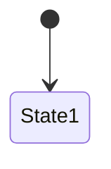
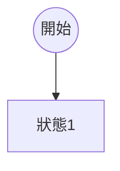
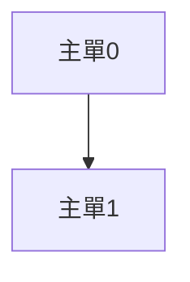
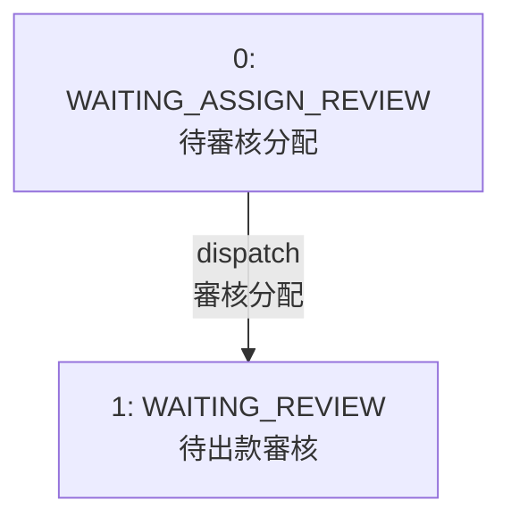
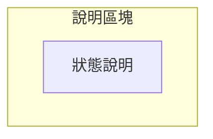
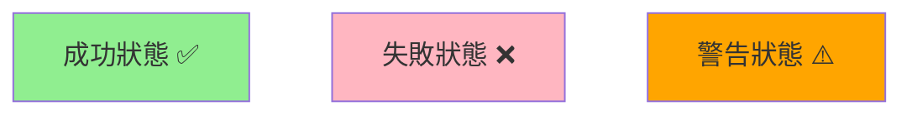
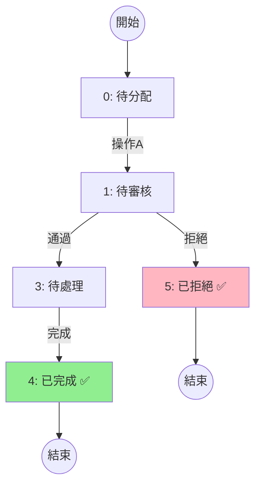
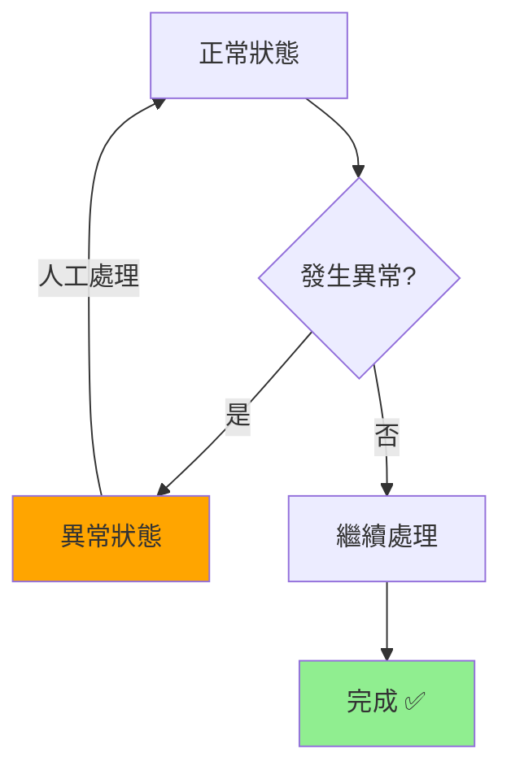

# Obsidian Mermaid Skill

當生成 Mermaid 圖表（尤其是在 Markdown 文件中）時，**必須**遵循以下規則以確保與 Obsidian 兼容。

## 必須遵循的規則

### 1. 使用 `flowchart` 替代 `stateDiagram`

❌ **禁止：**


✅ **正確：**


### 2. 節點 ID 必須使用英文

❌ **禁止：**


✅ **正確：**


**常用節點 ID 命名規範：**
- 主單狀態：`M0`, `M1`, `M3`, `M4`...
- 子單狀態：`S3`, `S4`, `S6`, `S7`...
- 流程步驟：`A`, `B`, `C` 或 `Step1`, `Step2`...
- 判斷節點：`Decision1`, `Check1`...

### 3. 換行使用 `<br/>` 而非 `\n`

❌ **禁止：**
```
M1 -->|"標籤\n第二行"| M2
```

✅ **正確：**
```
M1 -->|"標籤<br/>第二行"| M2
```

### 4. 中文文字放在標籤中



### 5. 避免使用 `note` 語法

❌ **禁止：**
```mermaid
stateDiagram-v2
    note right of State1
        說明文字
    end note
```

✅ **正確：使用 subgraph 或樣式替代**


### 6. 終止狀態使用樣式標記



**顏色參考：**
- 成功/完成：`fill:#90EE90` (淺綠)
- 失敗/拒絕：`fill:#FFB6C1` (淺紅)
- 警告/處理中：`fill:#FFA500` (橙色)
- 等待中：`fill:#87CEEB` (淺藍)

## 兼容的圖表類型

| 類型 | 兼容性 | 用途 |
|------|:------:|------|
| `flowchart TD` | ✅ | 流程圖（上到下） |
| `flowchart LR` | ✅ | 流程圖（左到右） |
| `sequenceDiagram` | ✅ | 時序圖 |
| `graph TD` | ✅ | 基本流程圖 |
| `pie` | ✅ | 圓餅圖 |
| `gantt` | ✅ | 甘特圖 |
| `stateDiagram-v2` | ❌ | 避免使用 |
| `stateDiagram` | ❌ | 避免使用 |

## 狀態圖範例模板

### 主單狀態流轉圖


### 異常處理流程圖

