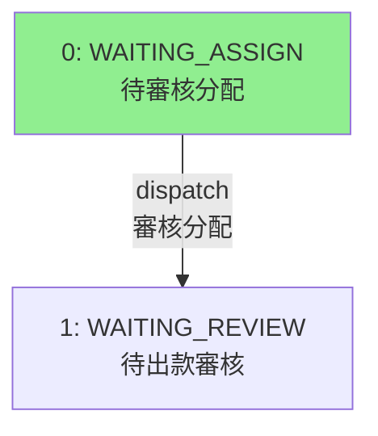

# Project Context: PLT Backend

## Overview
This is a large-scale Java/Spring Boot microservices backend project, likely for a financial or gaming platform ("plt"). It follows a multi-module Maven architecture, where each directory (e.g., `pay`, `plt-user`, `plt-fund`) represents a distinct service or module.

## Key Technologies
- **Language:** Java (Likely 17+)
- **Framework:** Spring Boot 3.x
- **Build Tool:** Maven
- **Database:** PostgreSQL (with Flyway for migrations)
- **ORM:** MyBatis Plus
- **Cache/KV:** Redis (Redisson)
- **Messaging:** RabbitMQ
- **Observability:** Micrometer, Prometheus, OpenTelemetry
- **Utilities:** Lombok, MapStruct, FastJSON

## Current Mission: Withdrawal System Refactoring
**Status:** In Progress (Phase 2 - Backend Implementation)
**Goal:** Simplify the withdrawal process by removing the "Withdrawal Assignment" (提款分配) and "Exception Handling" (異常提現處理) steps to create a "Direct Pass" (直通車) mode.

**Key Changes:**
1.  **Workflow Simplification:**
    *   Manual Withdraw: `Waiting Review (1)` -> `Waiting Pay (3)` -> `Payed (4)` (Skipping state `2`).
    *   3rd Party Withdraw: `Waiting Review (1)` -> `Waiting Pay (3)` -> `Processing (7)` (Skipping state `2`).
2.  **Deprecation Strategy:**
    *   **Do NOT delete code/columns.**
    *   Use `@Deprecated` annotation for Java classes/methods/fields.
    *   Use `DEPRECATED` comments for SQL columns and Mapper XMLs.
    *   Front-end will hide UI elements instead of removing code.

**Reference Documents:**
*   `doc/action-plan.md`: Detailed step-by-step execution plan. **(Primary Source of Truth)**
*   `pay/README.md`: Overview of the refactoring goals and state changes.
*   `doc/task.md`: Specific task tracking.

## Directory Structure
*   `pay/`: Payment service module.
*   `plt-fund/`: Fund management service module (Center of current refactoring).
*   `plt-user/`: User management service module.
*   `doc/`: Project documentation, SQL scripts, and action plans.
*   `pom.xml`: (In subdirectories) Maven build configuration.

## Build & Run
**Build:**
Standard Maven build (skip tests if necessary during dev):
```bash
mvn clean install -DskipTests
```

**Run:**
Spring Boot applications are typically run via their main class or Maven plugin:
```bash
mvn spring-boot:run
```

## Development Conventions
*   **Versioning:** Check `pom.xml` for dependencies. Use `com.galaxy:parent` as the parent POM.
*   **Code Style:** Standard Java/Spring conventions. Use Lombok for boilerplate.
*   **Testing:** JUnit tests are expected.
*   **Deprecation:** Strictly follow the "Annotate, Don't Delete" rule for the current withdrawal refactoring task.

## Mermaid Documentation Rules
When creating Mermaid diagrams in markdown files (especially for Obsidian compatibility):

1.  **Use `flowchart TD` instead of `stateDiagram-v2`** - State diagrams may fail to render in Obsidian.
2.  **Use English node IDs** - e.g., `M0`, `S1`, `A1` instead of Chinese characters like `主單0`.
3.  **Put Chinese text in labels** - Use `M0["0: 待審核分配"]` format.
4.  **Use `<br/>` for line breaks** - Not `\n` in labels.
5.  **Avoid `note` syntax** - Use `subgraph` or inline comments instead.

**Example:**


**Reference:** See `/mermaid-obsidian-guide` workflow for detailed examples.

## Actionable Context
When working on the codebase, always check `doc/action-plan.md` to see which phase of the refactoring is currently active. We are currently ensuring backend code (Enumerations, Entities, DTOs, Services) reflects the deprecation of states `-3`, `-2`, and `2`, and the logic shift for state `1` -> `3`.
