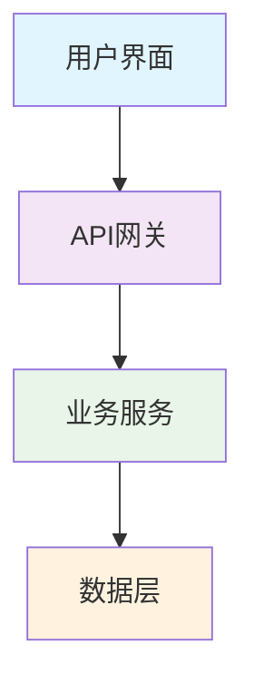
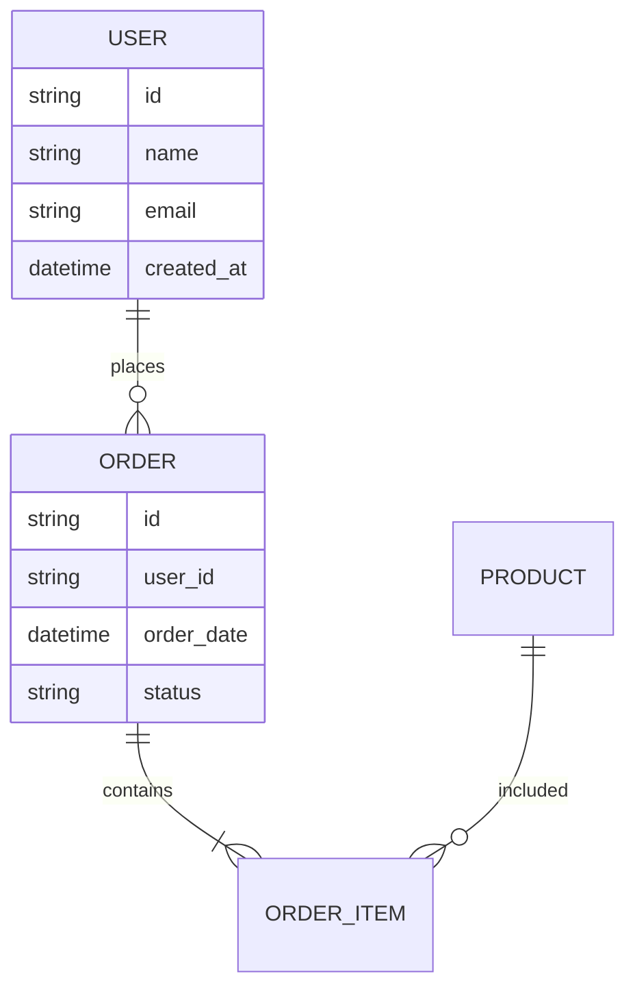

# 技术设计文档模板

## 概述

### 项目名称
[项目名称]

### 设计目标
[描述设计要达成的目标]

### 范围
[明确设计的范围和边界]

## 系统架构

### 整体架构


### 架构模式
- [ ] 分层架构
- [ ] 微服务架构
- [ ] 事件驱动架构
- [ ] 其他：[说明]

### 技术栈选择
| 层级 | 技术选择 | 理由 |
|------|----------|------|
| 前端 | [技术] | [选择理由] |
| 后端 | [技术] | [选择理由] |
| 数据库 | [技术] | [选择理由] |
| 缓存 | [技术] | [选择理由] |
| 消息队列 | [技术] | [选择理由] |

## 数据设计

### 数据模型


### 数据库设计
#### 主要表结构

**表1：用户表 (users)**
```sql
CREATE TABLE users (
    id UUID PRIMARY KEY DEFAULT gen_random_uuid(),
    name VARCHAR(100) NOT NULL,
    email VARCHAR(255) UNIQUE NOT NULL,
    password_hash VARCHAR(255) NOT NULL,
    created_at TIMESTAMP DEFAULT CURRENT_TIMESTAMP,
    updated_at TIMESTAMP DEFAULT CURRENT_TIMESTAMP
);
```

**表2：订单表 (orders)**
```sql
CREATE TABLE orders (
    id UUID PRIMARY KEY DEFAULT gen_random_uuid(),
    user_id UUID NOT NULL REFERENCES users(id),
    total_amount DECIMAL(10,2) NOT NULL,
    status VARCHAR(50) NOT NULL,
    order_date TIMESTAMP DEFAULT CURRENT_TIMESTAMP
);
```

### 数据访问层
```java
// 使用 Lombok 的 Repository 模式示例
@Repository
@Mapper
public interface UserMapper extends BaseMapper<User> {

    @Select("SELECT * FROM users WHERE email = #{email}")
    User findByEmail(@Param("email") String email);

    @Select("SELECT * FROM users WHERE status = #{status}")
    List<User> findByStatus(@Param("status") Integer status);

    @Update("UPDATE users SET last_login_time = #{time} WHERE id = #{id}")
    void updateLastLoginTime(@Param("id") Long id, @Param("time") LocalDateTime time);
}

// 实体类使用 Lombok
@Data
@Builder
@NoArgsConstructor
@AllArgsConstructor
@EqualsAndHashCode(callSuper = false)
@TableName("users")
public class User extends BaseEntity {

    private String username;

    private String email;

    @JsonIgnore
    private String password;

    @TableField("phone_number")
    private String phoneNumber;

    @Builder.Default
    private Integer status = 1;

    @JsonFormat(pattern = "yyyy-MM-dd HH:mm:ss")
    private LocalDateTime lastLoginTime;
}
```

## API 设计

### RESTful API 设计

#### 认证相关
```java
// 使用 Lombok 的用户注册 DTO
@Data
@Builder
@NoArgsConstructor
@AllArgsConstructor
public class CreateUserRequest {

    @NotBlank(message = "用户名不能为空")
    @Size(min = 2, max = 50, message = "用户名长度必须在2-50个字符之间")
    private String name;

    @NotBlank(message = "邮箱不能为空")
    @Email(message = "邮箱格式不正确")
    private String email;

    @NotBlank(message = "密码不能为空")
    @Size(min = 6, max = 20, message = "密码长度必须在6-20个字符之间")
    private String password;
}

// 使用 Lombok 的用户注册响应 DTO
@Data
@Builder
@NoArgsConstructor
@AllArgsConstructor
public class AuthResponse {

    private UserDTO user;

    private String token;

    private Long expiresIn;
}
```

#### 用户管理
```java
// 使用 Lombok 的用户控制器
@RestController
@RequestMapping("/api/users")
@Slf4j
@RequiredArgsConstructor
public class UserController {

    private final UserService userService;

    @GetMapping("/{id}")
    @SneakyThrows(UserNotFoundException.class)
    public ResponseEntity<ApiResponse<UserDTO>> getUser(
        @PathVariable Long id,
        @RequestHeader("Authorization") String token) {

        UserDTO user = userService.getUserById(id);

        return ResponseEntity.ok(ApiResponse.<UserDTO>builder()
                .success(true)
                .data(user)
                .message("获取用户信息成功")
                .build());
    }

    @PutMapping("/{id}")
    @SneakyThrows
    public ResponseEntity<ApiResponse<UserDTO>> updateUser(
        @Valid @PathVariable Long id,
        @Valid @RequestBody UpdateUserRequest request,
        @RequestHeader("Authorization") String token) {

        UserDTO updatedUser = userService.updateUser(id, request);

        return ResponseEntity.ok(ApiResponse.<UserDTO>builder()
                .success(true)
                .data(updatedUser)
                .message("更新用户信息成功")
                .build());
    }
}

// 统一响应类
@Data
@Builder
@NoArgsConstructor
@AllArgsConstructor
public class ApiResponse<T> {

    private boolean success;

    private T data;

    private String message;

    private String timestamp = LocalDateTime.now().toString();

    public static <T> ApiResponse<T> success(T data, String message) {
        return ApiResponse.<T>builder()
                .success(true)
                .data(data)
                .message(message)
                .build();
    }

    public static <T> ApiResponse<T> error(String message) {
        return ApiResponse.<T>builder()
                .success(false)
                .message(message)
                .build();
    }
}
```

### API 规范
- **认证方式**：JWT Bearer Token
- **数据格式**：JSON
- **错误处理**：统一错误响应格式
- **版本控制**：URL 版本控制 (`/api/v1/`)

## 安全设计

### 认证和授权
```java
// JWT Token 实体
public class JWTPayload {
    private Long userId;
    private String email;
    private String role;
    private Long exp;
    private Long iat;
    // getters and setters
}

// 权限控制拦截器
@Component
public class AuthInterceptor implements HandlerInterceptor {

    @Override
    public boolean preHandle(HttpServletRequest request,
                           HttpServletResponse response,
                           Object handler) throws Exception {
        String token = request.getHeader("Authorization");
        if (token == null || !token.startsWith("Bearer ")) {
            response.sendError(401, "未提供认证令牌");
            return false;
        String cleanToken = token.replace("Bearer ", "");

        try {
            // 验证 JWT Token
            Jwts.parserBuilder()
                .setSigningKey(jwtSecret)
                .build()
                .parseClaimsJws(cleanToken);
            return true;
        } catch (JwtException e) {
            response.sendError(401, "无效的认证令牌");
            return false;
        }
    }
}
```

### 数据安全
- **密码加密**：使用 bcrypt 进行密码哈希
- **输入验证**：所有用户输入进行验证和清理
- **SQL 注入防护**：使用参数化查询
- **XSS 防护**：输出转义和 CSP 策略

## 性能设计

### 缓存策略
```java
// Redis 缓存服务
@Service
public class CacheService {

    @Autowired
    private RedisTemplate<String, Object> redisTemplate;

    // 缓存用户数据（5分钟）
    public void cacheUser(Long userId, User userData) {
        String key = "user:" + userId;
        redisTemplate.opsForValue().set(key, userData, 5, TimeUnit.MINUTES);
    }

    // 获取缓存用户
    @SuppressWarnings("unchecked")
    public User getCachedUser(Long userId) {
        String key = "user:" + userId;
        return (User) redisTemplate.opsForValue().get(key);
    }

    // 缓存查询结果（1小时）
    public void cacheQueryResult(String key, Object result) {
        redisTemplate.opsForValue().set(key, result, 1, TimeUnit.HOURS);
    }
}
```

### 数据库优化
- **索引策略**：为常用查询字段建立索引
- **查询优化**：使用 EXPLAIN 分析查询性能
- **连接池**：配置数据库连接池
- **分页**：大数据集使用分页查询

## 错误处理

### 错误分类
```java
// 错误代码枚举
public enum ErrorCode {
    VALIDATION_ERROR("VALIDATION_ERROR"),
    AUTHENTICATION_ERROR("AUTHENTICATION_ERROR"),
    AUTHORIZATION_ERROR("AUTHORIZATION_ERROR"),
    NOT_FOUND("NOT_FOUND"),
    INTERNAL_ERROR("INTERNAL_ERROR"),
    EXTERNAL_SERVICE_ERROR("EXTERNAL_SERVICE_ERROR");

    private final String code;

    ErrorCode(String code) {
        this.code = code;
    }

    public String getCode() {
        return code;
    }
}

// 错误响应 DTO
public class ErrorResponse {
    private boolean success = false;
    private ErrorDetail error;

    public static class ErrorDetail {
        private ErrorCode code;
        private String message;
        private Object details;
        private String timestamp;
        private String requestId;
        // getters and setters
    }
    // getters and setters
}
```

### 全局错误处理
```java
// 全局异常处理器
@ControllerAdvice
public class GlobalExceptionHandler {

    @ExceptionHandler(Exception.class)
    public ResponseEntity<ErrorResponse> handleException(
            Exception ex, HttpServletRequest request) {

        String requestId = request.getHeader("X-Request-ID");

        // 记录错误日志
        logger.error("Error occurred - RequestId: {}, Path: {}, Method: {}, Error: {}",
                requestId, request.getRequestURI(), request.getMethod(), ex.getMessage(), ex);

        // 构建错误响应
        ErrorResponse response = new ErrorResponse();
        ErrorResponse.ErrorDetail error = new ErrorResponse.ErrorDetail();
        error.setCode(ErrorCode.INTERNAL_ERROR);
        error.setMessage("服务器内部错误");
        error.setTimestamp(Instant.now().toString());
        error.setRequestId(requestId);
        response.setError(error);

        return ResponseEntity.status(500).body(response);
    }
}
```

## 测试策略

### 测试金字塔
```
    E2E Tests (少量)
    /\
   /  \
  /    \
 /      \
/________\
Integration Tests (适量)
/        \
/          \
/____________\
Unit Tests (大量)
```

### 测试覆盖
- **单元测试**：目标覆盖率 80%
- **集成测试**：主要 API 端点和数据库交互
- **端到端测试**：关键用户流程

## 部署设计

### 容器化
```dockerfile
# Dockerfile 示例
FROM node:20-alpine AS builder

WORKDIR /app
COPY package*.json ./
RUN npm ci --only=production

COPY . .
RUN npm run build

FROM node:20-alpine AS runtime
WORKDIR /app
COPY --from=builder /app/dist ./dist
COPY --from=builder /app/node_modules ./node_modules
COPY package.json ./

EXPOSE 3000
CMD ["node", "dist/index.js"]
```

### CI/CD 流程
```yaml
# GitHub Actions 示例
name: CI/CD Pipeline

on:
  push:
    branches: [main]
  pull_request:
    branches: [main]

jobs:
  test:
    runs-on: ubuntu-latest
    steps:
      - uses: actions/checkout@v3
      - uses: actions/setup-node@v3
        with:
          node-version: '20'
      - run: npm ci
      - run: npm test
      - run: npm run build

  deploy:
    needs: test
    runs-on: ubuntu-latest
    if: github.ref == 'refs/heads/main'
    steps:
      - uses: actions/checkout@v3
      - name: Deploy to production
        run: ./scripts/deploy.sh
```

## 监控和日志

### 应用监控
- **性能监控**：响应时间、吞吐量、错误率
- **资源监控**：CPU、内存、磁盘、网络
- **业务监控**：用户活跃度、功能使用情况

### 日志策略
```java
// 结构化日志配置
@Configuration
public class LoggingConfig {

    @Bean
    public Logger structuredLogger() {
        LoggerContext context = (LoggerContext) LoggerFactory.getILoggerFactory();

        // 创建 JSON 格式的 appender
        JsonEncoder<ILoggingEvent> jsonEncoder = new JsonEncoder<>();
        jsonEncoder.start();

        RollingFileAppender<ILoggingEvent> errorFileAppender = new RollingFileAppender<>();
        errorFileAppender.setName("ERROR_FILE");
        errorFileAppender.setFile("logs/error.log");
        errorFileAppender.setEncoder(jsonEncoder);
        errorFileAppender.setFilter(new ThresholdFilter(Level.ERROR));
        errorFileAppender.start();

        RollingFileAppender<ILoggingEvent> combinedFileAppender = new RollingFileAppender<>();
        combinedFileAppender.setName("COMBINED_FILE");
        combinedFileAppender.setFile("logs/combined.log");
        combinedFileAppender.setEncoder(jsonEncoder);
        combinedFileAppender.start();

        // 配置根 logger
        ch.qos.logback.classic.Logger rootLogger = context.getLogger(Logger.ROOT_LOGGER_NAME);
        rootLogger.addAppender(errorFileAppender);
        rootLogger.addAppender(combinedFileAppender);
        rootLogger.setLevel(Level.INFO);

        return LoggerFactory.getLogger("structured-logger");
    }
}
```

## 扩展性考虑

### 水平扩展
- 无状态设计
- 负载均衡
- 数据库读写分离
- 微服务拆分

### 未来规划
- [ ] 国际化支持
- [ ] 多租户架构
- [ ] 实时通信
- [ ] 机器学习集成

---

**设计决策记录 (ADR)**：

1. **ADR-001: 选择微服务架构**
   - 状态：已接受
   - 理由：支持独立部署和扩展
   - 后果：增加了系统复杂性，需要服务发现机制

2. **ADR-002: 使用 JWT 进行认证**
   - 状态：已接受
   - 理由：无状态认证，便于水平扩展
   - 后果：需要处理 token 过期和刷新机制

**版本历史**：
- v1.0 - [日期] - 初始设计文档
- v1.1 - [日期] - [修改内容]