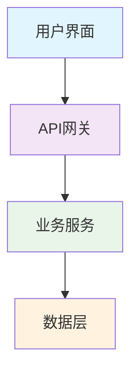
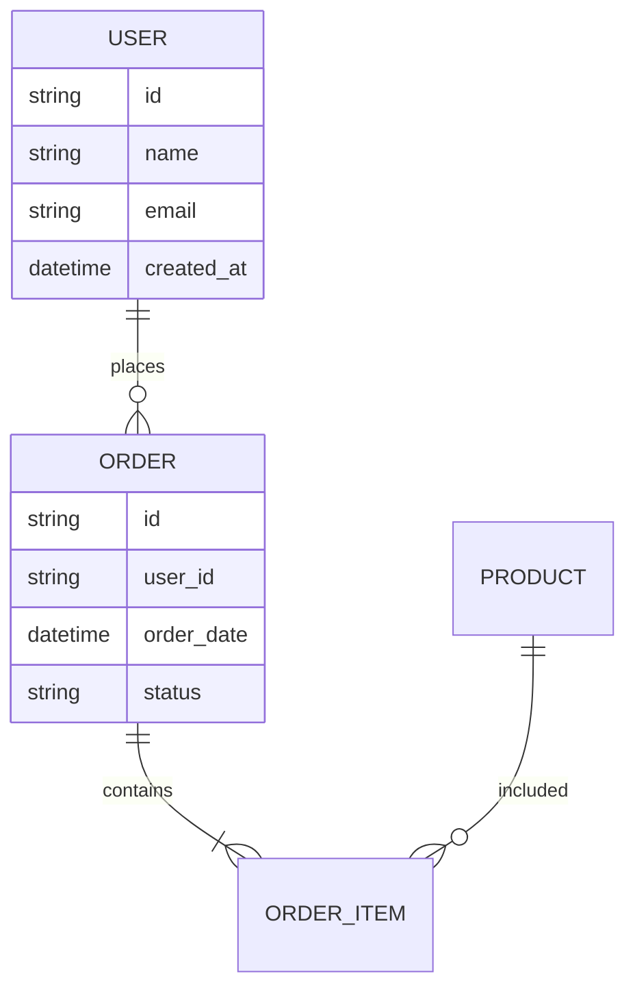

# 技术设计文档模板

## 概述

### 项目名称
[项目名称]

### 设计目标
[描述设计要达成的目标]

### 范围
[明确设计的范围和边界]

## 系统架构

### 整体架构


### 架构模式
- [ ] 分层架构
- [ ] 微服务架构
- [ ] 事件驱动架构
- [ ] 其他：[说明]

### 技术栈选择
| 层级 | 技术选择 | 理由 |
|------|----------|------|
| 前端 | [技术] | [选择理由] |
| 后端 | [技术] | [选择理由] |
| 数据库 | [技术] | [选择理由] |
| 缓存 | [技术] | [选择理由] |
| 消息队列 | [技术] | [选择理由] |

## 数据设计

### 数据模型


### 数据库设计
#### 主要表结构

**表1：用户表 (users)**
```sql
CREATE TABLE users (
    id UUID PRIMARY KEY DEFAULT gen_random_uuid(),
    name VARCHAR(100) NOT NULL,
    email VARCHAR(255) UNIQUE NOT NULL,
    password_hash VARCHAR(255) NOT NULL,
    created_at TIMESTAMP DEFAULT CURRENT_TIMESTAMP,
    updated_at TIMESTAMP DEFAULT CURRENT_TIMESTAMP
);
```

**表2：订单表 (orders)**
```sql
CREATE TABLE orders (
    id UUID PRIMARY KEY DEFAULT gen_random_uuid(),
    user_id UUID NOT NULL REFERENCES users(id),
    total_amount DECIMAL(10,2) NOT NULL,
    status VARCHAR(50) NOT NULL,
    order_date TIMESTAMP DEFAULT CURRENT_TIMESTAMP
);
```

### 数据访问层
```typescript
// Repository 模式示例
interface UserRepository {
    create(user: CreateUserDto): Promise<User>;
    findById(id: string): Promise<User | null>;
    findByEmail(email: string): Promise<User | null>;
    update(id: string, data: UpdateUserDto): Promise<User>;
    delete(id: string): Promise<void>;
}
```

## API 设计

### RESTful API 设计

#### 认证相关
```typescript
// 用户注册
POST /api/auth/register
Content-Type: application/json

{
  "name": "用户姓名",
  "email": "user@example.com",
  "password": "password123"
}

// 响应
{
  "success": true,
  "data": {
    "user": {
      "id": "uuid",
      "name": "用户姓名",
      "email": "user@example.com"
    },
    "token": "jwt_token"
  }
}
```

#### 用户管理
```typescript
// 获取用户信息
GET /api/users/{id}
Authorization: Bearer {token}

// 响应
{
  "success": true,
  "data": {
    "id": "uuid",
    "name": "用户姓名",
    "email": "user@example.com",
    "created_at": "2023-01-01T00:00:00Z"
  }
}

// 更新用户信息
PUT /api/users/{id}
Authorization: Bearer {token}
Content-Type: application/json

{
  "name": "新姓名",
  "email": "new@example.com"
}
```

### API 规范
- **认证方式**：JWT Bearer Token
- **数据格式**：JSON
- **错误处理**：统一错误响应格式
- **版本控制**：URL 版本控制 (`/api/v1/`)

## 安全设计

### 认证和授权
```typescript
// JWT Token 结构
interface JWTPayload {
    userId: string;
    email: string;
    role: 'admin' | 'user';
    exp: number;
    iat: number;
}

// 权限控制中间件
const requireAuth = (req: Request, res: Response, next: NextFunction) => {
    const token = req.headers.authorization?.replace('Bearer ', '');
    if (!token) {
        return res.status(401).json({ error: '未提供认证令牌' });
    }

    try {
        const decoded = jwt.verify(token, process.env.JWT_SECRET);
        req.user = decoded;
        next();
    } catch (error) {
        return res.status(401).json({ error: '无效的认证令牌' });
    }
};
```

### 数据安全
- **密码加密**：使用 bcrypt 进行密码哈希
- **输入验证**：所有用户输入进行验证和清理
- **SQL 注入防护**：使用参数化查询
- **XSS 防护**：输出转义和 CSP 策略

## 性能设计

### 缓存策略
```typescript
// Redis 缓存示例
interface CacheService {
    // 缓存用户数据（5分钟）
    cacheUser(userId: string, userData: User): Promise<void>;

    // 获取缓存用户
    getCachedUser(userId: string): Promise<User | null>;

    // 缓存查询结果（1小时）
    cacheQueryResult(key: string, result: any): Promise<void>;
}
```

### 数据库优化
- **索引策略**：为常用查询字段建立索引
- **查询优化**：使用 EXPLAIN 分析查询性能
- **连接池**：配置数据库连接池
- **分页**：大数据集使用分页查询

## 错误处理

### 错误分类
```typescript
enum ErrorCode {
    VALIDATION_ERROR = 'VALIDATION_ERROR',
    AUTHENTICATION_ERROR = 'AUTHENTICATION_ERROR',
    AUTHORIZATION_ERROR = 'AUTHORIZATION_ERROR',
    NOT_FOUND = 'NOT_FOUND',
    INTERNAL_ERROR = 'INTERNAL_ERROR',
    EXTERNAL_SERVICE_ERROR = 'EXTERNAL_SERVICE_ERROR'
}

interface ErrorResponse {
    success: false;
    error: {
        code: ErrorCode;
        message: string;
        details?: any;
        timestamp: string;
        requestId: string;
    };
}
```

### 全局错误处理
```typescript
const errorHandler = (error: Error, req: Request, res: Response, next: NextFunction) => {
    const requestId = req.headers['x-request-id'] || generateRequestId();

    // 记录错误日志
    logger.error({
        error: error.message,
        stack: error.stack,
        requestId,
        userId: req.user?.id,
        path: req.path,
        method: req.method
    });

    // 返回标准化错误响应
    const response: ErrorResponse = {
        success: false,
        error: {
            code: ErrorCode.INTERNAL_ERROR,
            message: '服务器内部错误',
            timestamp: new Date().toISOString(),
            requestId
        }
    };

    res.status(500).json(response);
};
```

## 测试策略

### 测试金字塔
```
    E2E Tests (少量)
    /\
   /  \
  /    \
 /      \
/________\
Integration Tests (适量)
/        \
/          \
/____________\
Unit Tests (大量)
```

### 测试覆盖
- **单元测试**：目标覆盖率 80%
- **集成测试**：主要 API 端点和数据库交互
- **端到端测试**：关键用户流程

## 部署设计

### 容器化
```dockerfile
# Dockerfile 示例
FROM node:20-alpine AS builder

WORKDIR /app
COPY package*.json ./
RUN npm ci --only=production

COPY . .
RUN npm run build

FROM node:20-alpine AS runtime
WORKDIR /app
COPY --from=builder /app/dist ./dist
COPY --from=builder /app/node_modules ./node_modules
COPY package.json ./

EXPOSE 3000
CMD ["node", "dist/index.js"]
```

### CI/CD 流程
```yaml
# GitHub Actions 示例
name: CI/CD Pipeline

on:
  push:
    branches: [main]
  pull_request:
    branches: [main]

jobs:
  test:
    runs-on: ubuntu-latest
    steps:
      - uses: actions/checkout@v3
      - uses: actions/setup-node@v3
        with:
          node-version: '20'
      - run: npm ci
      - run: npm test
      - run: npm run build

  deploy:
    needs: test
    runs-on: ubuntu-latest
    if: github.ref == 'refs/heads/main'
    steps:
      - uses: actions/checkout@v3
      - name: Deploy to production
        run: ./scripts/deploy.sh
```

## 监控和日志

### 应用监控
- **性能监控**：响应时间、吞吐量、错误率
- **资源监控**：CPU、内存、磁盘、网络
- **业务监控**：用户活跃度、功能使用情况

### 日志策略
```typescript
// 结构化日志示例
const logger = winston.createLogger({
    level: 'info',
    format: winston.format.combine(
        winston.format.timestamp(),
        winston.format.json()
    ),
    transports: [
        new winston.transports.File({ filename: 'error.log', level: 'error' }),
        new winston.transports.File({ filename: 'combined.log' })
    ]
});
```

## 扩展性考虑

### 水平扩展
- 无状态设计
- 负载均衡
- 数据库读写分离
- 微服务拆分

### 未来规划
- [ ] 国际化支持
- [ ] 多租户架构
- [ ] 实时通信
- [ ] 机器学习集成

---

**设计决策记录 (ADR)**：

1. **ADR-001: 选择微服务架构**
   - 状态：已接受
   - 理由：支持独立部署和扩展
   - 后果：增加了系统复杂性，需要服务发现机制

2. **ADR-002: 使用 JWT 进行认证**
   - 状态：已接受
   - 理由：无状态认证，便于水平扩展
   - 后果：需要处理 token 过期和刷新机制

**版本历史**：
- v1.0 - [日期] - 初始设计文档
- v1.1 - [日期] - [修改内容]