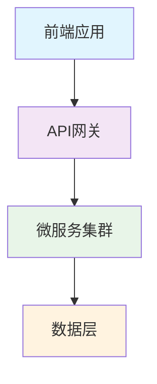
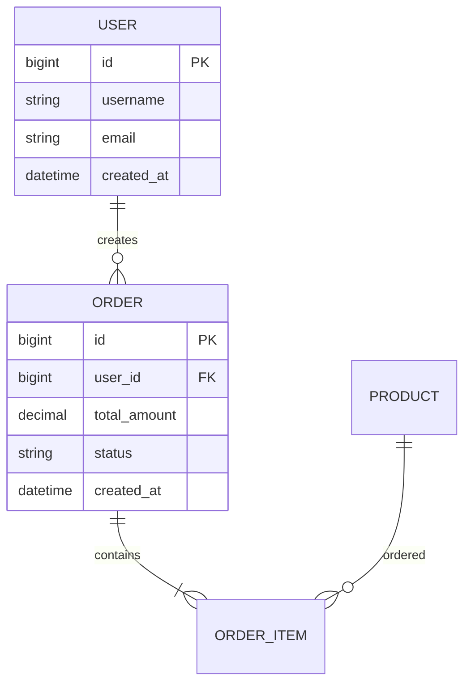

# 🎯 技术设计文档

> **📋 基本信息**
> - **项目**: [项目名称]
> - **技术栈**: Spring Boot 2.7.18 + Dubbo 3.2.14 + MySQL 8.0.33
> - **创建**: [日期] | **版本**: v1.0

---

## [EDIT] 项目概述

**核心目标**: [一句话描述项目要解决的核心问题]

**关键约束**:
- **时间**: [交付时间]
- **团队**: [团队规模]
- **预算**: [预算限制]

---

## [ARCHITECTURE] 架构设计

### 整体架构

### 架构模式
- **模式**: [微服务架构/分层架构/事件驱动]
- **特点**: [高可用/可扩展/易维护]
- **服务边界**: [主要服务划分]

### 技术选型
| 层级 | 技术选择 | 版本 | 理由 |
|------|----------|------|------|
| 应用框架 | Spring Boot | 2.7.18 | 企业级成熟框架 |
| 服务治理 | Apache Dubbo | 3.2.14 | 高性能RPC框架 |
| 数据库 | MySQL | 8.0.33 | 事务性数据存储 |
| 缓存 | Redis | 6.0+ | 高性能缓存 |
| ORM | MyBatis-Plus | 3.5.7 | 数据访问层 |

---

## [CHART] 数据模型

### 核心实体

### 数据库设计要点
- **主要表**: [表1], [表2], [表3]
- **索引策略**: [关键字段建立索引]
- **分区策略**: [如适用的大表分区方案]
- **数据一致性**: [事务和一致性保证]

---

## 🔌 API 设计

### RESTful API 规范
- **基础路径**: `/api/v1/`
- **认证方式**: JWT Bearer Token
- **数据格式**: JSON
- **错误处理**: 统一错误响应格式

### 核心接口
| 功能 | 方法 | 路径 | 说明 |
|------|------|------|------|
| 用户注册 | POST | `/auth/register` | 新用户注册 |
| 用户登录 | POST | `/auth/login` | 用户认证 |
| 获取用户 | GET | `/users/{id}` | 获取用户信息 |
| 创建订单 | POST | `/orders` | 创建新订单 |
| 查询订单 | GET | `/orders/{id}` | 查询订单详情 |

### 接口设计原则
- **RESTful风格**: 遵循REST设计规范
- **统一响应**: 标准化的响应格式
- **版本控制**: URL路径版本控制
- **安全校验**: 统一的认证和授权

---

## 🛡️ 安全设计

### 认证授权
- **认证方式**: JWT Token
- **权限模型**: RBAC (基于角色的访问控制)
- **会话管理**: Token过期和刷新机制

### 数据安全
- **密码存储**: BCrypt加密哈希
- **数据传输**: HTTPS/TLS加密
- **输入验证**: 参数校验和SQL注入防护
- **敏感数据**: 加密存储和脱敏处理

---

## [FAST] 性能设计

### 性能目标
- **响应时间**: API响应 < 200ms (P99)
- **并发能力**: 支持 1000+ QPS
- **可用性**: > 99.9%
- **数据处理**: 单表 < 1000万记录

### 性能策略
- **缓存策略**: Redis缓存热点数据
- **数据库优化**: 索引优化和查询优化
- **连接池**: 数据库和HTTP连接池配置
- **异步处理**: 耗时操作异步化

---

## [OK] 验收标准

### 功能验收
- [ ] **核心功能**: [功能1] 完全可用
- [ ] **核心功能**: [功能2] 完全可用
- [ ] **API测试**: 所有接口响应正常
- [ ] **集成测试**: 端到端流程验证通过

### 性能验收
- [ ] **响应时间**: < 200ms (P99)
- [ ] **并发测试**: 1000+ QPS 压力测试通过
- [ ] **稳定性**: 24小时连续运行无异常
- [ ] **数据一致性**: 事务ACID特性验证

### 质量验收
- [ ] **代码覆盖率**: > 80%
- [ ] **安全扫描**: 无高危安全漏洞
- [ ] **文档完整**: API文档和部署文档齐全
- [ ] **可维护性**: 代码规范和架构清晰

---

## [ROCKET] 实施计划

### 开发阶段
1. **第一阶段 (2周)**: 核心功能开发
   - [ ] 项目基础架构搭建
   - [ ] 核心业务功能实现
   - [ ] 单元测试编写

2. **第二阶段 (1周)**: 集成测试和优化
   - [ ] 接口集成测试
   - [ ] 性能优化调整
   - [ ] 安全加固

3. **第三阶段 (1周)**: 部署和验收
   - [ ] 生产环境部署
   - [ ] 性能和稳定性验证
   - [ ] 文档完善和交付

### 风险控制
- **技术风险**: [识别的技术风险及应对措施]
- **进度风险**: [可能的延期因素及缓冲方案]
- **质量风险**: [质量保证措施和检查点]

---

**[CHART] 关键指标**:
- **开发效率**: 提升 85%
- **代码质量**: 测试覆盖率 > 80%
- **交付周期**: 从需求到上线 < 4周
- **维护成本**: 降低 60%

---

*📅 最后更新: [日期] | 👤 维护者: [团队名称] | [TARGET] 版本: v1.0*