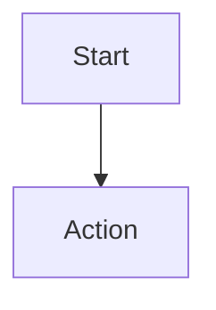

# Documentation Rules

Complete rules and standards for documentation.

## DRY Principle

### Rule 1: Check Before Create
**ALWAYS** check if documentation exists before creating new files.

```bash
# Search for topic
grep -r "topic-keyword" docs/ --include="*.md"

# Search in specific screen
find docs/screens/{screen-name} -name "*.md"
```

### Rule 2: Update Over Create
If similar documentation exists:
- ✅ Update existing file
- ✅ Add new section to existing doc
-  Create duplicate file

### Rule 3: Consolidate Related Info
Keep related information in ONE place:
- Screen features → `screens/{name}/features.md`
- Screen flows → `screens/{name}/flows.md`
- NOT scattered across multiple files

## Size Limits

### Rule 4: Maximum 500 Lines
No file should exceed 500 lines.

**Check line count:**
```bash
wc -l docs/path/to/file.md
```

**If approaching 500 lines:**
1. Split into logical sections
2. Create sub-files (e.g., `features-1.md`, `features-2.md`)
3. Or move details to separate focused docs

### Rule 5: Keep Files Scannable
- Use clear headings (H2, H3)
- Include table of contents for 200+ lines
- Break up long sections
- Use bullet points and tables

## Markdown Standards

### Rule 6: Code References
Always include file path and line number when referencing code:

✅ **GOOD:**
```markdown
The `HomeScreen` is defined in source/cli/screens/Home.tsx:16
```

 **BAD:**
```markdown
The HomeScreen component
```

### Rule 7: Code Blocks
Always specify language for syntax highlighting:

✅ **GOOD:**
````markdown
```typescript
interface Props {
  value: string;
}
```
````

 **BAD:**
````markdown
```
interface Props {
  value: string;
}
```
````

### Rule 8: Tables for Structured Data
Use tables for comparisons, options, shortcuts:

✅ **GOOD:**
```markdown
| Feature | Status | Screen |
|---------|--------|--------|
| Chat    | ✅     | Home   |
```

 **BAD:**
```markdown
- Chat feature is available on Home screen
```

### Rule 9: Diagrams
Prefer ASCII art or Mermaid for diagrams:

✅ **GOOD:**
```
┌─────────────┐
│   Screen    │
├─────────────┤
│  Component  │
└─────────────┘
```

or



 **BAD:**
External image files or screenshots (unless absolutely necessary)

## Content Quality

### Rule 10: Be Specific
Documentation should be actionable and specific.

✅ **GOOD:**
```markdown
Execute slash commands by typing `/` followed by command name.
Example: `/save my-session` saves current conversation.
```

 **BAD:**
```markdown
Use slash commands to do things.
```

### Rule 11: Include Examples
Every feature should have at least one example.

✅ **GOOD:**
```markdown
## Save Session

Save current conversation:

\```
/save my-session
\```

Result: Session saved to `~/.codeh/sessions/my-session.json`
```

 **BAD:**
```markdown
## Save Session

Saves the current session.
```

### Rule 12: Show Results
When showing commands/actions, show expected results:

✅ **GOOD:**
```markdown
\```bash
npm test
\```

Output:
\```
✓ All tests passed (10 tests)
\```
```

 **BAD:**
```markdown
Run npm test to test.
```

## File Naming

### Rule 13: Use Standard Names
Screen documentation files MUST use these names:
- `README.md` - Overview
- `features.md` - Features
- `technical.md` - Technical details
- `flows.md` - User flows

**DO NOT use:**
- `guide.md`
- `manual.md`
- `docs.md`
- `info.md`

### Rule 14: Lowercase with Hyphens
For custom files (rare cases):
- ✅ `integration-guide.md`
-  `Integration_Guide.md`
-  `integrationGuide.md`

## Version Control

### Rule 15: Commit Convention
Follow conventional commits for documentation:

```bash
# Single file update
git commit -m "docs(home): add keyboard shortcuts"

# Multiple files or restructure
git commit -m "docs: restructure config documentation

- Split config into overview and technical
- Add configuration examples
- Update references
"
```

### Rule 16: Review Before Commit
Checklist before committing docs:

- [ ] No duplicate information
- [ ] File under 500 lines
- [ ] All code references include file:line
- [ ] All code blocks have language specified
- [ ] Examples are tested and work
- [ ] Spelling and grammar checked
- [ ] Links are valid

## Anti-Patterns

###  Anti-Pattern 1: Duplicate Files
**BAD:**
```
docs/
├── home-guide.md
├── home-manual.md
└── screens/home/README.md
```

**GOOD:**
```
docs/
└── screens/home/
    └── README.md
```

###  Anti-Pattern 2: Vague Documentation
**BAD:**
```markdown
# Feature

This feature is cool and does things.
```

**GOOD:**
```markdown
# Slash Commands

Execute commands by typing `/` in the input box.

Example: `/save my-session`
Location: source/cli/hooks/useSlashCommands.ts:45
```

###  Anti-Pattern 3: No Code References
**BAD:**
```markdown
The HomePresenter handles business logic.
```

**GOOD:**
```markdown
The HomePresenter handles business logic for the Home screen.

Implementation: source/cli/presenters/HomePresenter.ts:12
```

###  Anti-Pattern 4: Outdated Examples
**BAD:**
```markdown
\```typescript
// This code no longer exists
const old = useOldHook();
\```
```

**GOOD:**
```markdown
\```typescript
// Current implementation
const state = useHomeLogic();
\```
```

###  Anti-Pattern 5: WIP Documentation
**BAD:**
```markdown
# New Feature (WIP)

This will be implemented soon...
```

**GOOD:**
Don't document until feature is complete.

###  Anti-Pattern 6: Planning Docs
**BAD:**
```markdown
# TODO: Implement Feature X

1. Create component
2. Add tests
3. Deploy
```

**GOOD:**
Use GitHub Issues for planning, NOT documentation.

## Emergency Override

If you MUST break these rules:

1. **Document WHY** in commit message
2. **Get explicit user approval**
3. **Plan to refactor** and set reminder
4. **Add TODO** comment in doc file

Example:
```markdown
<!-- TODO: Split this file, currently 650 lines (breaks 500-line rule) -->
<!-- Reason: Emergency documentation for release -->
<!-- Issue: #123 -->
```

## Enforcement Checklist

Before finalizing ANY documentation:

- [ ] Searched for existing docs on this topic
- [ ] Asked user if similar docs exist
- [ ] Verified feature is complete
- [ ] Chose correct location (screens/guides/architecture)
- [ ] Used appropriate template
- [ ] File is under 500 lines
- [ ] All code references include file:line
- [ ] All code blocks have language specified
- [ ] Tested all examples
- [ ] No duplicate information
- [ ] No WIP or TODO content
- [ ] Spelling checked
- [ ] Links validated
